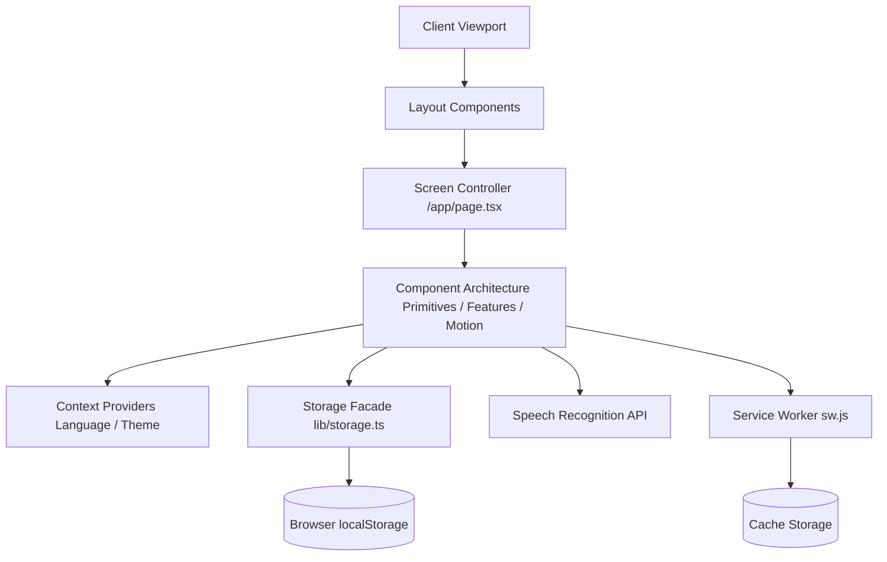
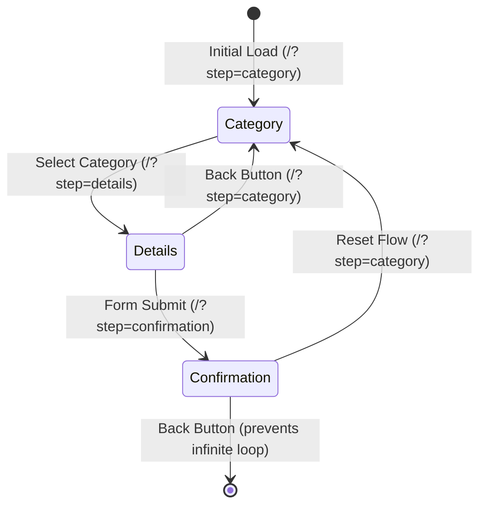
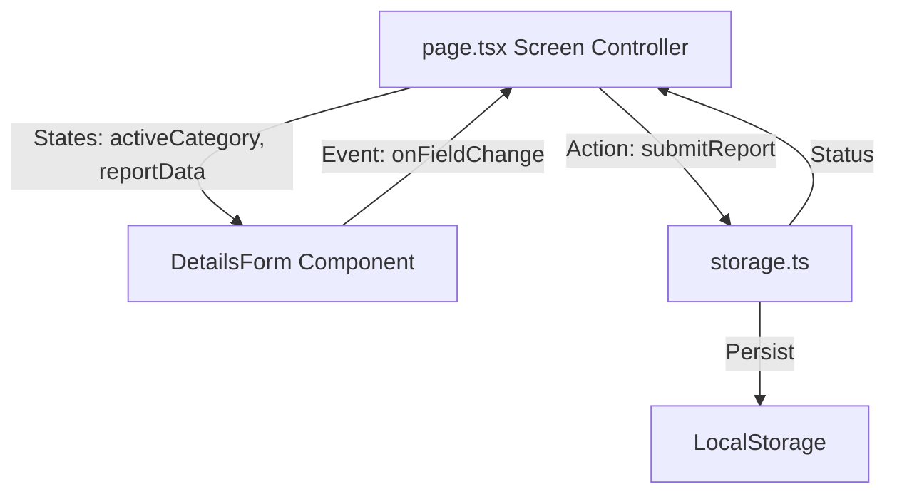
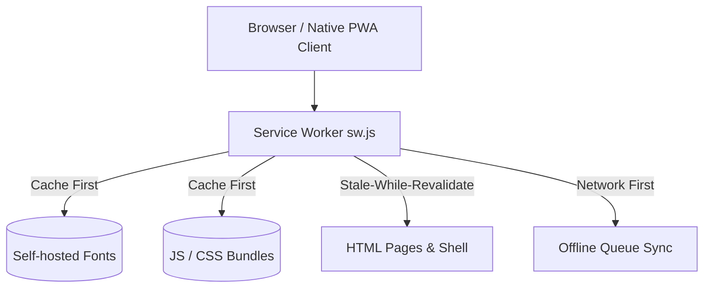
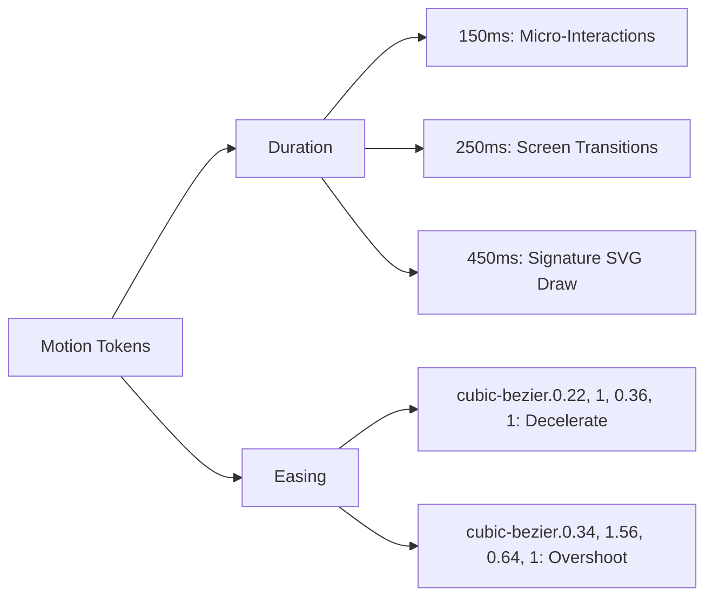
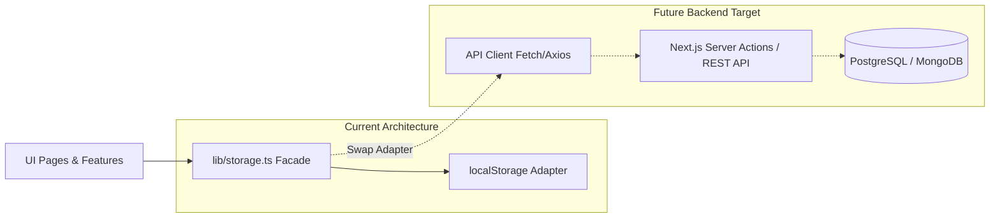

# Project Architecture — Nagrik

This document serves as the official engineering blueprint and architectural reference for the Nagrik Progressive Web Application (PWA). It outlines the design patterns, folder structures, module responsibilities, and performance strategies employed to build a highly responsive, mobile-first, offline-ready, and fully accessible civic reporting tool.

---

## 1. Project Architecture

Nagrik is engineered as an **offline-first, client-driven Next.js application** that operates entirely without a traditional backend database. The core architectural philosophy is based on **resilience, speed, and cognitive clarity**. 

### Architectural Pillars

1. **Decoupled Client Architecture**: All features are implemented as client-side modules. The UI is completely decoupled from storage and sync layers, allowing components to remain pure presenters of application state.
2. **Facade-Pattern Storage**: Browser `localStorage` is wrapped behind a storage manager facade. The rest of the application interacts with this abstract interface, isolating the components from storage implementations and serialization concerns.
3. **Provider-Led Configuration**: Global states such as internationalization (`i18n`), themes, and sync managers are distributed using React Context Providers, providing clean dependency injection without prop-drilling or external state managers.
4. **Resilient Offline Fallback**: Under low or zero connectivity, the application queues transactions locally. The state machine manages transitions between queued and synchronized states.
5. **Atomic Component Hierarchy**: UI elements are divided into strict layers based on their complexity and reuse scope.



---

## 2. Folder Structure

The directory layout is designed to group files by architectural role. By segregating business logic, static assets, and user interfaces, we ensure maximum code readability and maintainability.

```
/
├── app/                  # Next.js App Router Root
│   ├── favicon.ico       # PWA Icon file
│   ├── globals.css       # Design System CSS tokens & global styles
│   ├── layout.tsx        # HTML wrapper, font declarations & providers
│   └── page.tsx          # Single-Page Controller / Dynamic Router
├── components/           # Component Hierarchy
│   ├── features/         # Domain-Specific Components (CategoryGrid, DetailsForm, etc.)
│   ├── layout/           # Structural Layout Components (Header, Footer, PageShell)
│   ├── motion/           # Framer Motion Wrappers (CheckmarkDraw, StaggerList)
│   ├── primitives/       # Atomic UI Primitives (Button, Input, Textarea, Card)
│   └── typography/       # Multilingual Text Node Managers
├── lib/                  # Business Logic, Utilities, and services
│   ├── i18n.ts           # Translation dictionary, config & state hooks
│   ├── reference-id.ts   # Client-side ID generation and category mapping
│   ├── storage.ts        # LocalStorage CRUD operations and sync queues
│   └── voice.ts          # Web Speech API wrapper and capabilities check
└── public/               # Static assets and PWA scripts
    ├── fonts/            # Self-hosted WOFF2 web fonts (Grift, Hind, Geist Mono)
    ├── icons/            # Manifest-compliant PWA icons (192x192, 512x512)
    ├── manifest.json     # PWA Configuration Manifest
    └── sw.js             # Service Worker (Precaching, runtime, offline-ready)
```

### Folder Responsibilities

*   `app/`: Controls the routing structure, metadata injections, and layout foundations. Contains `globals.css` which translates `DESIGN.md` design tokens into CSS variables.
*   `components/`: Segregated by architectural role. No business logic (such as reading storage directly) resides in `primitives` or `motion` components.
*   `lib/`: Home of stateless logic, storage adapters, and service wrappers. Components import functions from this directory to execute side effects.
*   `public/`: Uncompiled assets served directly. This folder houses the Service Worker (`sw.js`) and PWA configuration (`manifest.json`), ensuring they are accessible at the root level of the application.

---

## 3. Routing Strategy

Nagrik employs a **Single-Page Application (SPA) Controller with Dynamic State Routing** integrated into the Next.js App Router. This approach meets the PWA requirement of ensuring the hardware/OS back button (specifically on Android PWA wrapper clients) navigates between screens rather than exiting the application.

### State-Synced URL Architecture

Instead of utilizing subfolders for each screen (which would cause server round-trips or layout resets under Slow 3G network conditions), Nagrik manages screen transitions via URL query parameters (`?step=category`, `?step=details`, `?step=confirmation`). 



### Route States

1.  **Category Selection (`/?step=category`)**
    *   *Role*: Grid display of default civic categories.
    *   *Navigation*: Selection of a category pushes state to URL, advancing to the Details screen.
2.  **Details Form (`/?step=details`)**
    *   *Role*: Detailed reports, camera attachments, voice input dictation.
    *   *Navigation*: Back button returns user to Category selection with state preserved. Submission pushes state to Confirmation.
3.  **Submission Confirmation (`/?step=confirmation`)**
    *   *Role*: Success feedback, SVG checkmark animation, reference ID display.
    *   *Navigation*: The browser back state is manipulated or configured so that backing out of confirmation returns the user safely to a clean Category selection screen, avoiding form submission resubmission loops.

### History Management Implementation

Dynamic updates to routing are executed via the Next.js `useRouter` hooks or the standard HTML5 History API (`window.history.pushState`). By capturing transitions inside history entries, we satisfy standard PWA audit checklists.

---

## 4. Component Architecture

To maintain visual consistency and enforce the guidelines defined in `DESIGN.md`, the UI components are organized into five distinct tiers. Dependencies flow strictly downward: a component can only import components from a lower tier.

```
[ Layout Components ]
         │
         ▼
[ Feature Components ]
         │
         ▼
[ Motion Components ] ──► [ Typography Components ]
         │                        │
         ▼                        ▼
               [ Primitives ]
```

### 1. Primitives (Atomic Components)
*   **Examples**: `Button`, `Input`, `Textarea`, `Card`, `Skeleton`, `Spacer`, `Badge`.
*   **Responsibility**: Presentational-only. Configured strictly via props. They have no knowledge of the application's domain logic, active language, or storage structure. They use CSS custom variables mapped to Tailwind themes for styling.
*   **Rules**: Must not perform side effects. Must support focus outlines, keyboard events, and custom CSS classes.

### 2. Feature Components (Domain Components)
*   **Examples**: `CategoryGrid`, `DetailsForm`, `VoiceInputController`, `PhotoUploader`, `OfflineBanner`, `ReportStatusTracker`.
*   **Responsibility**: Encapsulate civic-specific features. They capture user input, manage local component states, validate forms, interact with the Web Speech API, and interface with the storage layer.
*   **Rules**: Domain logic must reside here. They compose Primitives, Motion, and Typography components to assemble complex sections.

### 3. Layout Components (Structural Components)
*   **Examples**: `Header`, `Footer`, `PageShell`, `Container`.
*   **Responsibility**: Establish structural layouts, grid alignments, spacing structures, and universal utility components (such as `ThemeToggle` or `LanguageToggle`).
*   **Rules**: Layout components manage document flow. They do not hold domain data models.

### 4. Motion Components (Animation Components)
*   **Examples**: `AnimatePresenceWrapper`, `StaggerList`, `MicroScale`, `WaveformListening`, `CheckmarkDraw`.
*   **Responsibility**: Declare animations using Framer Motion. They provide structured animation wrappers that enforce duration and easing tokens.
*   **Rules**: Must verify user motion preferences (`prefers-reduced-motion`) and fall back to zero-motion or fade-only variants.

### 5. Typography Components (Text Node Components)
*   **Examples**: `Heading`, `DisplayText`, `ParagraphText`, `MonoText`.
*   **Responsibility**: Map text tokens to the correct font family depending on active language.
    *   *English*: Maps text nodes to `Grift` display/body weights.
    *   *Marathi*: Maps text nodes to `Hind` weights.
    *   *Digits/IDs*: Maps text nodes to `Geist Mono` for visual uniformity and alignment.
*   **Rules**: Must enforce appropriate heading hierarchies (`h1` through `h6`) and support semantic HTML elements.

---

## 5. State Management

To satisfy the bundle budget limits and prevent performance degradation under throttled Slow 3G network profiles, **Nagrik does not use external state management libraries (no Redux, no Zustand, no MobX)**. Instead, the application relies on React's native state-management mechanisms.

### State Hierarchy and Unidirectional Flow

The state is managed locally at the screen container level and passed down to children via standard props. State flows down, events flow up.



### State Storage Details

1.  **Global UI State (React Context)**:
    *   `LanguageContext`: Dispatches active language state (`en` vs `mr`) and feeds translation keys to the UI.
    *   `ThemeContext`: Controls theme state (`light` vs `dark`) and manages system color-scheme listener events.
2.  **Transient Form State (Local React State)**:
    *   Details form entries (such as description character length and compressed base64 images) are managed via standard React `useState` hooks inside the details component.
3.  **Persisted State (Storage Module)**:
    *   Submissions are persisted immediately on form submit directly into `localStorage`. The state update is decoupled from the rendering loop.

---

## 6. Internationalization (i18n)

Nagrik is designed with strict internationalization constraints: **hardcoded text strings are completely prohibited inside rendering templates**. 

### Translation Dictionary Structure

All labels, buttons, dynamic error descriptions, tooltips, ARIA descriptors, and text segments are isolated within a structured dictionary in `lib/i18n.ts`.

```typescript
// Conceptual structure of lib/i18n.ts
export const translations = {
  en: {
    category: {
      title: "Select Issue Category",
      roads: "Roads & Potholes",
      garbage: "Garbage & Sanitation",
      // ...
    },
    form: {
      descriptionPlaceholder: "Describe the civic issue in detail...",
      charLimit: "Characters remaining",
      validationEmpty: "Description cannot be empty",
      voiceListening: "Listening... speak now.",
      // ...
    }
  },
  mr: {
    category: {
      title: "समस्या प्रवर्ग निवडा",
      roads: "रस्ते आणि खड्डे",
      garbage: "कचरा आणि स्वच्छता",
      // ...
    },
    form: {
      descriptionPlaceholder: "समस्येचे सविस्तर वर्णन करा...",
      charLimit: "उर्वरित अक्षरे",
      validationEmpty: "वर्णन रिकामे असू शकत नाही",
      voiceListening: "ऐकत आहे... आता बोला.",
      // ...
    }
  }
} as const;
```

### Language Selection and persistence

*   **Custom Hook (`useTranslation`)**: Exposes translation methods and locale-switching controls to components.
*   **State Persistence**: The active language configuration is saved in the browser's `localStorage`. During startup, the application detects the persisted locale. If missing, it falls back to the user's browser language (`navigator.language`), defaulting to English if no match is found.

---

## 7. PWA Architecture

The PWA implementation ensures that Nagrik behaves like a native application on supported platforms, featuring offline access, service worker-based resource delivery, and direct prompt installations.



### Progressive Web App Specifications

1.  **Web App Manifest (`public/manifest.json`)**:
    *   Declares installation properties (name, short name, start URL, display mode).
    *   Defines theme and background colors derived from `DESIGN.md` tokens:
        *   Light Theme: `theme_color: "#FAFAFA"`, `background_color: "#FAFAFA"`
        *   Dark Theme: `theme_color: "#0A0A0C"`, `background_color: "#0A0A0C"`
    *   Points to high-res icons (192x192 and 512x512) for home screen shortcuts.
2.  **Service Worker (`public/sw.js`)**:
    *   **Precaching**: Statically compiles a list of primary app files (the shell) to cache during registration.
    *   **Stale-While-Revalidate**: Applied to HTML page paths. Serves cache content instantly, fetching updates in the background to ensure next-load freshness.
    *   **Cache-First**: Applied to hashed webpack assets (`_next/static/`) and local fonts (`public/fonts/`). Since these are immutable, caching assets directly saves cellular bandwidth.
3.  **Offline Submission Queue (P1 feature)**:
    *   Under offline status, the storage layer changes submission statuses to `queued`.
    *   The service worker or a window-level listener detects network restoration (`window.addEventListener('online')`), triggering a synchronization sweep that updates the submission statuses to `submitted`.
4.  **Native Installation Promotion**:
    *   Intercepts the browser's `beforeinstallprompt` event.
    *   Stores the event trigger, making it available to the UI.
    *   Displays an install banner or button within the interface to trigger standard native prompts.

---

## 8. Storage

All application persistence is client-side, using the browser's `localStorage` API. The schema, persistence rules, and ID generations are isolated inside the `lib/` directory.

### Submission Model Schema

The TypeScript interface for a submission record is structured as follows:

```typescript
export interface Submission {
  id: string;                      // Unique ID (e.g., "RD-7X9K2")
  category: string;                // Category identifier key (e.g., "roads")
  description: string;             // Text body (Max 500 chars)
  photo: string | null;            // Base64 compressed image string or null
  usedVoiceInput: boolean;         // Dictation metrics flag
  createdAt: string;               // ISO 8601 string timestamp
  status: "queued" | "submitted";  // Offline-first queue state
  language: "en" | "mr";           // Active language during submission
}
```

### Reference ID Generation

To ensure reports resemble professional government registries, the reference ID generator maps category selections to prefixes and appends a randomized, uppercase alphanumeric suffix:

$$\text{Format: } [\text{Category Prefix}] - [\text{5 Alphanumeric Characters}]$$

| Category | Key | Prefix | Example Reference ID |
| :--- | :--- | :--- | :--- |
| Roads & Potholes | `roads` | `RD` | `RD-B8D2K` |
| Garbage & Sanitation | `garbage` | `GB` | `GB-H4R9P` |
| Water Supply | `water` | `WS` | `WS-X1W3M` |
| Streetlights | `streetlights` | `SL` | `SL-K7L2T` |
| Public Safety | `safety` | `PS` | `PS-Z9Q4N` |
| Other | `other` | `OT` | `OT-C3V5X` |

---

## 9. Motion Architecture

Nagrik balances sensory delight with restrained interface behaviors, implementing transitions and loading feedback using **Framer Motion**.

### Motion Tokens (DESIGN.md Alignment)



### Signature SVG Draw Animation

The PWA uses a signature micro-interaction on successful report completion:
1.  **Checkmark Icon**: An SVG checkmark path scales and uses a staggered `stroke-dashoffset` to "draw" itself on screen over `450ms` using the custom overshoot easing.
2.  **Reference ID Stagger**: The letters of the generated ID are dynamically mapped to individual motion spans, animating their opacity and vertical positions sequentially.

### Reduced Motion Support

A custom wrapper checks user system preferences. When `prefers-reduced-motion` is active:
*   Layout animations are disabled.
*   The checkmark draw falls back to a simple, fast opacity fade.
*   Slide-ins and scaling scale transitions resolve instantly.

---

## 10. Performance Strategy

To satisfy the target **Lighthouse Performance Score >= 95** on simulated mobile devices, Nagrik adopts several optimization strategies:

1.  **Zero-Dependency Form Management**: Form handlers are custom-written to avoid loading heavy third-party schema validators or dynamic parser packages.
2.  **Self-Hosted and Subset Web Fonts**: Fonts are loaded locally. WOFF2 formats are used to minimize size, and stylesheets use `font-display: swap` to prevent visual blocking.
3.  **Canvas Image Compression**: Images captured via camera are loaded into a temporary canvas, compressed to a target JPEG quality (e.g., `0.7`), scaled down to a maximum width of `800px`, and converted to base64. This prevents exceeding the `5MB` browser storage limit.
4.  **Asset Bundling optimizations**: Hashed JS files generated by Next.js are cached via service workers.
5.  **Simulated Slow 3G Resilience**: The app is tested under network throttling. Dynamic imports are configured for non-critical features, ensuring interactive frames render quickly.

---

## 11. Accessibility (a11y)

Nagrik is built to meet **WCAG 2.2 AA standards**, aiming for a **Lighthouse Accessibility Score >= 95**.

*   **Keyboard Operability**: Every interactive component (e.g., category selection cards, theme selectors) is fully navigable using `Tab` and triggers actions with `Enter` / `Space`.
*   **Focus Ring Design**: Components use high-contrast, customized focus rings aligned with design system color ramps. Default browser-specific focus rings are disabled in favor of uniform custom styling.
*   **Semantic Elements**: Layout structure is built on semantic tags (`<header>`, `<main>`, `<section>`, `<footer>`). Inputs are correctly bound to `<label>` containers, and custom components utilize explicit `role` definitions.
*   **Screen Reader Integration**: State updates (like "listening for voice input" or "syncing offline queues") use screen-reader accessible attributes (`aria-live="polite"` or `aria-live="assertive"`).

---

## 12. Coding Standards

A uniform codebase ensures rapid maintenance and predictable code behavior. Nagrik enforces strict conventions:

### Naming Conventions

*   **React Components**: PascalCase (e.g., `CategoryGrid.tsx`, `DetailsForm.tsx`).
*   **Helper Functions & Hooks**: camelCase (e.g., `useTranslation.ts`, `generateReferenceId.ts`).
*   **Design Tokens & CSS Variables**: kebab-case (e.g., `--text-primary-light`, `bg-light`).
*   **Constant Configs**: UPPERCASE_SNAKE_CASE (e.g., `DEFAULT_CATEGORIES`, `MAX_CHAR_LIMIT`).

### Code Organization & Composition

Components must separate UI display code from operations. State selectors and service triggers reside in custom hooks, while UI components remain clean render trees.

```typescript
// Component Import Sequence
import React, { useState } from "react";                  // 1. React & framework dependencies
import { motion } from "framer-motion";                  // 2. Third-party UI/utility dependencies
import { Heading } from "@/components/typography";        // 3. Typography modules
import { Button } from "@/components/primitives";        // 4. Atomic Primitive components
import { useTranslation } from "@/lib/i18n";             // 5. Hooks and state managers
import { submitReport } from "@/lib/storage";            // 6. Helpers, assets, and styles
```

---

## 13. Future Scalability

Although Nagrik operates purely as a client-side PWA, the architecture is designed to support a future migration to a centralized server database without requiring changes to the UI layer.

### Interface-First Database Migration

The local storage service `lib/storage.ts` functions as a database facade. The UI interacts with it through standard, asynchronous function calls.



### Upgrading the Synchronizer

1.  **Swapping the Adapter**: When migrating to a backend database, only `lib/storage.ts` needs to be updated. Its methods can be rewritten to send API requests to REST/GraphQL endpoints or trigger Next.js Server Actions instead of calling `localStorage`.
2.  **Background Sync Integration**: The offline queue mechanism can be upgraded from simple runtime status listener checks to a native Service Worker Background Sync schema (`SyncManager` API). Using this approach, the service worker takes over sync management, running jobs in the background even after the user closes the application tab.
3.  **Authentication Integration**: Global auth tokens (such as JSON Web Tokens) can be managed within a client-side provider and automatically attached to requests in the API adapter layer, keeping the presentation layer completely auth-agnostic.
